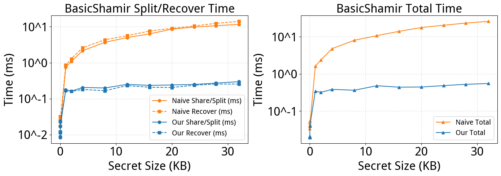
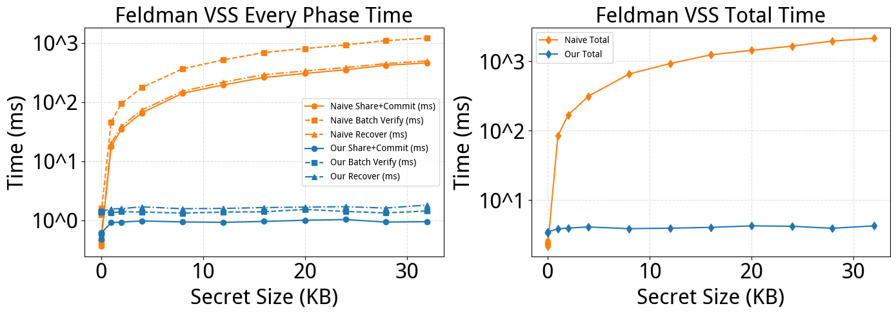

# 可验证多方安全秘密共享算法

> 本项目是2025年华为Hackathon软件挑战赛的参赛作品。
> 
> 参赛人：皇甫泊宁，陈奕莱，卓识
> 
> 2025.10

## 运行环境与脚本运行方法

### 运行环境

-   操作系统：Linux（WSL 环境）

-   Python 版本：3.10.18 （最推荐，**如果版本过高 pip install
    可能不成功**）

-   依赖库版本：见 requirements.txt

### 依赖与环境配置

使用虚拟环境进行依赖安装，命令如下：

``` {.bash language="bash"}
python3 -m venv .venv
source .venv/bin/activate
pip install -r requirements.txt # 请注意 python 版本！
```

### 脚本运行方法

``` {.bash language="bash"}
# 运行下发测试及自编测试
python tests/run_tests.py
# 性能对比测试及绘图
python performance_test/benchmark_secret_sharing.py
# 运行 demo，成功后打开相应生成端口
python src/app.py
```

运行完成后，测试结果将输出在终端中，用于验证各模块的功能正确性与整体集成情况。

# 性能优化策略

本项目主要围绕大密钥处理与批量验证效率进行优化，目标是在保证安全性的前提下减少加密与重构的开销。

## 在 basic_shamir.py 中支持处理最大32KB密钥

本方案设计了"标准模式+混合加密模式"双架构，实现对不同规模秘密的全覆盖支持。

对于长度$\leq$ `block_size`的小秘密（如16字节AES密钥），通过
`_split_secret_standard`
直接执行经典Shamir拆分，无需额外加密步骤，保持高效计算；对于长度 $\geq$
1024bit的大秘密，则通过 `_split_secret_hybrid`
启用混合加密：动态生成适配当前`block_size`的AES密钥（128/192/256位自适应），用AES-GCM模式加密原始大秘密，仅对短AES密钥执行Shamir拆分。该方法确保了接口一致、I/O
高效和加密认证的安全性。

## 在 feldman_vss.py 中支持批处理份额验证

为提升多份额验证的吞吐量，本方案提出一种三阶段协同策略。第一阶段，通过对承诺
$C_j$ 预计算并缓存其幂表
$i^j$，以复用昂贵的计算资源。第二阶段，对待验证集合采用双随机种子进行聚合验证，以约
$\frac{1}{q^{2}}$
的极低误判率快速剪枝，概率性地剔除绝大多数无效份额。第三阶段，对聚合后剩余的少数份额，利用幂次缓存进行确定性的零误差验证，确保最终结果的准确性。该策略通过"空间换时间"的设计，将计算成本前置为可控的缓存开销，以换取批量验证场景下的高复用与低延迟，并提供配置选项以平衡在内存受限环境下的时空开销。


# 性能测试报告

我们对于超长秘密和批处理验证问题做出了一些优化，并对优化后的结果与较朴素的做法的性能进行了多组数据测试，得到如下结果。

## 超长秘密处理

### 分块优化

#### 核心思路

分块优化基于"流式分块 +
独立多项式"策略，将大密钥拆分为多个小数据块，每个块独立执行 Shamir
拆分，最终将所有块的份额打包为完整份额。具体逻辑如下：

1\. 分块：将大密钥按
`block_size`（有限域支持的最大单块长度）拆分为多个连续数据块；

2\.
独立拆分：为每个数据块生成一套独立的随机多项式（以该块编码后的值为常数项），计算所有份额在该块上的
`y` 值（多项式结果）；

3\. 份额打包：每个参与者的最终份额为"所有块的 `y` 值按顺序拼接"（每个
`y` 值占固定字节数 `value_bytes`）；

4\. 反操作恢复：将打包的份额拆分为各块的 `y`
值，对每个块独立执行拉格朗日插值恢复原始块，最后拼接所有块得到完整大密钥。

#### 局限性

-   **计算开销显著增加**

    \- 多项式生成次数随块数 $k$ 线性增长（传统方法仅1组，分块方法需 $k$
    组）；

    \- 份额计算与拉格朗日插值复杂度从 $O(nt)$ 升至 $O(knt)$（$n$
    为份额总数，$t$ 为阈值），块数越多耗时越长。

-   **份额存储体积膨胀**

    \- 单个份额大小与块数 $k$ 成正比（每个块贡献 `value_bytes`
    字节）；

    \- 示例：32KB
    密钥在256位素数下，单个份额体积约34.1KB，远超传统方法的32字节，增加存储与传输成本。

### AES优化

#### 双模式架构

设计"标准模式+混合加密模式"双架构，实现对不同规模秘密的全覆盖支持。

对于长度 $\leq$ `block_size`的小秘密（如16字节AES密钥），通过
`_split_secret_standard`
直接执行经典Shamir拆分，无需额外加密步骤，保持高效计算；

对于长度 $\geq$ 1024bit的大秘密，则通过 `_split_secret_hybrid`
启用混合加密：动态生成适配当前`block_size`的AES密钥（128/192/256位自适应），用AES-GCM模式加密原始大秘密，仅对短AES密钥执行Shamir拆分。

两种模式通过 `split_secret`
方法自动切换，无需用户手动判断，既解决了传统Shamir受有限域限制的问题，又降低了使用门槛。

### 效果对比



#### 算法拆分与恢复耗时

-   **Our Share/Split、Our Recover**

    蓝色线条几乎与横轴平行且耗时极低，表明随着秘密大小从 0KB 增长到
    32KB，快速模式下的拆分时间和恢复时间基本不受秘密大小影响，耗时极低且稳定。

-   **Naive Share/Split、Naive Recover**

    橙色线条呈明显上升趋势，说明慢速模式下，拆分时间和恢复时间随秘密大小增加而快速增长，大秘密会带来较高时间成本。

#### 总耗时

-   **Our Total**

    蓝色线条贴近横轴，说明无论秘密大小如何变化，快速模式的总耗时稳定在
    0.1ms。

-   **Naive Total**

    橙色线条呈陡峭上升趋势，秘密大小从 0KB 增至 30KB 时，总耗时从接近 0
    快速攀升至约 25ms，验证了慢速模式总耗时随秘密大小增长而显著增加。

### 结论

BasicShamir
算法的AES优化在秘密拆分、恢复及总耗时上，均展现出"低延迟、不随秘密大小变化"的优势，适合对性能敏感的场景；而分块优化耗时与秘密大小强相关，大秘密会带来较高时间成本，可能在大秘密加密保护等场景中承担核心逻辑。

## FeldmanVSS性能优化

### 批量验证的聚合优化（`aggregate_batch_verify`）

#### 核心思路

利用随机线性组合的数学性质，将多份额验证的复杂度从 $O(n  t \log q)$
降低至 $O(nt + t\log n\log q)$（其中 n 为份额数量，t 为阈值）。

具体通过以下步骤实现：

1\. 生成随机权重 $r_i$（每个份额对应一个随机数）；

2\. 构造聚合验证等式：
$$g^{\sum r_i \cdot s_i} \equiv \prod_{j=0}^{t-1} C_j^{\sum r_i \cdot i^j} \pmod{p}$$

其中，左侧为生成元 $g$ 对"加权份额和"的幂，右侧为承诺值 $C_j$
对"加权指数和"的幂的乘积。

#### 优化效果

\- 原本验证 $n$ 个份额需 $n \times t$ 次模幂运算，聚合后仅需 $t$
次，计算量大幅减少；

\- 通过双种子策略（两套独立随机权重）将误判概率降至 $\sim 1/q^2$（ $q$
为大素数），兼顾效率与可靠性。

### 批处理验证的分层策略

#### 分层验证流程

1\. **聚合剪枝**：先用 `aggregate_batch_verify`
快速验证整批份额，若通过则直接判定全部有效；

2\.
**确定性校验**：对聚合验证失败的子集，通过预计算的幂次缓存逐份精确验证，确保无误差。

#### 预计算优化

\- 预计算承诺值 $C_j$
的二次幂表（ $C_j^{2^0}, C_j^{2^1}, \dots$ ）和生成元 $g$ 的二次幂表；

\- 对份额编号 $i$ 的幂次 $i^j$
采用迭代计算（ $i^j = i^{j-1} \cdot i \mod q$ ），避免重复调用 `pow`
函数。

### 效果演示



#### 阶段耗时

-   **Our Mode**

    \- 耗时稳定性：无论秘密大小从 0KB 增长至 30KB，"Fast
    Share+Commit""Fast Batch Verify""Fast
    Recover"三项操作的耗时始终贴近横轴，波动极小；

    \-
    秘密大小无关性：耗时未随秘密尺寸增加而上升，表明快速模式的计算开销主要取决于阈值参数（如份额数量
    $n$、阈值 $t$），而非秘密本身的长度；

    \- 绝对耗时低：所有操作耗时均处于微秒级（图表视觉上接近
    0），适合对实时性要求高的场景（如分布式节点快速共识）。

-   **Naive Mode**

    \- 强相关性："Slow Share+Commit""Slow Batch Verify""Slow
    Recover"的耗时随秘密大小增长快速上升，斜率较大；

    \-
    操作差异："分享+承诺生成"与"批量验证"耗时增长幅度略高于"恢复"操作，推测因慢速模式下承诺生成需额外处理大秘密的分块签名或复杂验证逻辑；

    \- 大秘密开销：当秘密达到 30KB
    时，单操作耗时已明显高于快速模式（视觉上差距达 1-2 个数量级）。

#### 总耗时

-   **Our Total**

    蓝色菱形标记线条几乎与横轴重合，表明：

    \- 总耗时不受秘密大小影响，始终维持在极低水平（微秒级）；

    \-
    各项操作的低开销具有叠加稳定性，适合高频次秘密分享场景（如传感器网络密钥更新）。

-   **Naive Total**

    橙色线条呈现陡峭上升趋势：

    \- 秘密从 0KB 增至 30KB 时，总耗时从接近 0 攀升至约 1400ms（1.4
    秒），增长幅度达百倍级；

    \-
    总耗时与秘密大小的强相关性（线性拟合度高），说明慢速模式可能包含与秘密长度成正比的操作（如逐字节加密、分块哈希计算等）。
